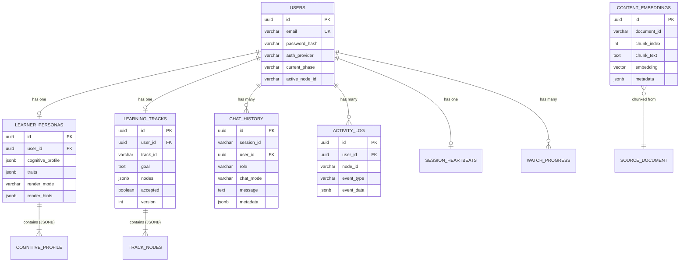

# Module 8: Data Persistence — Implementation Specification

> **Tech Stack**: PostgreSQL 15+ · Spring Data JPA · Flyway Migrations · JSONB · pgvector
> **Reference**: All modules (M5–M7) depend on this layer

---

## 1. Module Responsibility

This module owns all persistent storage — relational tables, JSONB document columns, and vector embeddings. Every other backend module reads from and writes to M8 via Spring Data JPA repositories.

---

## 2. Project Structure

```
src/main/java/com/oreo/engine/persistence/
├── entity/
│   ├── UserEntity.java                    # Maps to "users" table (email, password_hash, auth_provider)
│   ├── LearnerPersonaEntity.java          # Maps to "learner_personas" table
│   ├── LearningTrackEntity.java           # Maps to "learning_tracks" table
│   ├── ChatMessageEntity.java             # Maps to "chat_history" table
│   ├── ActivityEventEntity.java           # Maps to "activity_log" table
│   └── ContentEmbeddingEntity.java        # Maps to "content_embeddings" table (pgvector)
│
├── repository/
│   ├── UserRepository.java
│   ├── PersonaRepository.java
│   ├── TrackRepository.java
│   ├── ChatMessageRepository.java
│   ├── ActivityEventRepository.java
│   └── ContentEmbeddingRepository.java    # Custom native queries for vector similarity
│
├── converter/
│   ├── JsonbConverter.java                # JPA AttributeConverter: Java Object ↔ JSONB column
│   └── NodeListConverter.java             # Converts List<TrackNode> ↔ JSONB
│
└── migration/                             # Flyway SQL migrations
    ├── V1__create_users_and_auth.sql
    ├── V2__create_personas.sql
    ├── V3__create_tracks.sql
    ├── V4__create_chat_history.sql
    ├── V5__create_activity_log.sql
    ├── V6__create_content_embeddings.sql
    ├── V7__create_session_heartbeats.sql
    ├── V8__create_watch_progress.sql
    ├── V9__create_study_schedules.sql
    ├── V10__create_spaced_repetition_log.sql
    ├── V11__create_code_snippets.sql
    ├── V12__create_user_notes.sql
    └── V13__create_saved_diagrams.sql
```

---

## 3. Database Schema (All Tables)

### 3a. `users` — User Accounts

```sql
-- V1__create_users_and_auth.sql

CREATE TABLE users (
    id              UUID PRIMARY KEY DEFAULT gen_random_uuid(),
    email           VARCHAR(255) UNIQUE NOT NULL,
    password_hash   VARCHAR(255),
        -- BCrypt hash. NULL for Google-only accounts.
    display_name    VARCHAR(100),
    picture_url     TEXT,
        -- Profile picture URL (populated from Google account if applicable)
    auth_provider   VARCHAR(10) NOT NULL DEFAULT 'EMAIL',
        -- Enum: 'EMAIL', 'GOOGLE'
    current_phase   VARCHAR(20) NOT NULL DEFAULT 'ONBOARDING',
        -- Enum: ONBOARDING, CALIBRATION, EXECUTION
    active_node_id  VARCHAR(50),
        -- The node the user is currently working on (null until EXECUTION phase)
    created_at      TIMESTAMP NOT NULL DEFAULT NOW(),
    updated_at      TIMESTAMP NOT NULL DEFAULT NOW()
);

CREATE INDEX idx_users_email ON users(email);
```

### 3b. `learner_personas` — Cognitive Profiles

```sql
-- V2__create_personas.sql

CREATE TABLE learner_personas (
    id                  UUID PRIMARY KEY DEFAULT gen_random_uuid(),
    user_id             UUID NOT NULL UNIQUE REFERENCES users(id) ON DELETE CASCADE,
    cognitive_profile   JSONB NOT NULL,
        -- Structure:
        -- {
        --   "logic": 72,
        --   "visualization": 88,
        --   "applied": 65,
        --   "theoretical": 45
        -- }
    traits              JSONB NOT NULL DEFAULT '[]',
        -- Array: ["Deadline-Driven", "Visual-Heavy", "Low Resilience"]
    render_mode         VARCHAR(20) NOT NULL DEFAULT 'visual',
        -- Derived from cognitive_profile: "visual" | "textual"
    render_hints        JSONB NOT NULL DEFAULT '{}',
        -- {
        --   "prefer_diagrams": true,
        --   "prefer_video_over_text": true,
        --   "code_font_size": "large"
        -- }
    raw_interview_data  JSONB,
        -- Stores the full inferred persona from the Dynamic Profiler:
        -- { "domain": "Frontend", "iq_logic": "Visual", "eq_resilience": "..." }
    created_at          TIMESTAMP NOT NULL DEFAULT NOW(),
    updated_at          TIMESTAMP NOT NULL DEFAULT NOW()
);
```

**JSONB Query Examples**:
```sql
-- Find all visual learners
SELECT * FROM learner_personas WHERE render_mode = 'visual';

-- Find users with visualization score > 80
SELECT * FROM learner_personas
WHERE (cognitive_profile->>'visualization')::int > 80;

-- Find users with a specific trait
SELECT * FROM learner_personas
WHERE traits @> '["Deadline-Driven"]';
```

### 3d. `learning_tracks` — Personalized DAGs

```sql
-- V3__create_tracks.sql

CREATE TABLE learning_tracks (
    id          UUID PRIMARY KEY DEFAULT gen_random_uuid(),
    user_id     UUID NOT NULL REFERENCES users(id) ON DELETE CASCADE,
    track_id    VARCHAR(100) NOT NULL,
        -- Human-readable ID: "react_custom_101"
    goal        TEXT NOT NULL,
        -- "Build a real-time React dashboard with WebSockets"
    nodes       JSONB NOT NULL,
        -- Array of TrackNode objects (see JSONB structure below)
    accepted    BOOLEAN NOT NULL DEFAULT FALSE,
        -- True once user clicks "Accept Quest"
    version     INT NOT NULL DEFAULT 1,
        -- Optimistic locking: incremented on every DAG mutation.
        -- Prevents race conditions when Watchdog + Feedback Gate mutate simultaneously.
    created_at  TIMESTAMP NOT NULL DEFAULT NOW(),
    updated_at  TIMESTAMP NOT NULL DEFAULT NOW()
);

CREATE INDEX idx_tracks_user ON learning_tracks(user_id);
```

**Optimistic Locking Pattern** (L7 Fix):
```sql
-- Every DAG mutation reads the current version, then updates with version check:
UPDATE learning_tracks
SET nodes = $new_nodes, version = version + 1, updated_at = NOW()
WHERE user_id = $userId AND version = $expectedVersion;
-- If 0 rows affected → concurrent modification detected → retry
```

**JSONB Mutation Examples**:
```sql
-- Update a specific node's status to COMPLETED
UPDATE learning_tracks
SET nodes = (
    SELECT jsonb_agg(
        CASE
            WHEN elem->>'id' = 'n1'
            THEN jsonb_set(elem, '{status}', '"COMPLETED"')
            ELSE elem
        END
    )
    FROM jsonb_array_elements(nodes) AS elem
)
WHERE user_id = 'u_abc123';

-- Insert a new remedial node into the nodes array
UPDATE learning_tracks
SET nodes = nodes || '[{
    "id": "n2_remedial",
    "title": "State Async Review",
    "type": "visual_theory",
    "status": "ACTIVE",
    "prereqs": []
}]'::jsonb
WHERE user_id = 'u_abc123';
```

### 3e. `chat_history` — Conversation Logs

```sql
-- V4__create_chat_history.sql

CREATE TABLE chat_history (
    id          UUID PRIMARY KEY DEFAULT gen_random_uuid(),
    session_id  VARCHAR(100) NOT NULL,
        -- Groups messages by conversation session
    user_id     UUID NOT NULL REFERENCES users(id) ON DELETE CASCADE,
    role        VARCHAR(10) NOT NULL,
        -- "user" | "ai" | "system"
    chat_mode   VARCHAR(20) NOT NULL,
        -- "interview" | "negotiation" | "mentor"
    message     TEXT NOT NULL,
    metadata    JSONB,
        -- Optional: {
        --   "confidence_score": 75,
        --   "video_timestamp": 135,
        --   "canvas_node_id": "n2"
        -- }
    created_at  TIMESTAMP NOT NULL DEFAULT NOW()
);

CREATE INDEX idx_chat_session ON chat_history(session_id);
CREATE INDEX idx_chat_user ON chat_history(user_id);
CREATE INDEX idx_chat_mode ON chat_history(chat_mode);
```

### 3f. `activity_log` — User Event Audit Trail

```sql
-- V5__create_activity_log.sql

CREATE TABLE activity_log (
    id          UUID PRIMARY KEY DEFAULT gen_random_uuid(),
    user_id     UUID NOT NULL REFERENCES users(id) ON DELETE CASCADE,
    node_id     VARCHAR(50),
    event_type  VARCHAR(50) NOT NULL,
        -- "video_progress" | "article_scroll" | "chat_message" |
        -- "quiz_submit" | "canvas_interaction" | "heartbeat"
    event_data  JSONB,
        -- {
        --   "currentTime": 135,
        --   "totalDuration": 720,
        --   "percentComplete": 18.75
        -- }
    created_at  TIMESTAMP NOT NULL DEFAULT NOW()
);

CREATE INDEX idx_activity_user ON activity_log(user_id);
CREATE INDEX idx_activity_time ON activity_log(created_at);

-- Partition by month for large-scale deployments (optional):
-- CREATE TABLE activity_log (...) PARTITION BY RANGE (created_at);
```

### 3g. `session_heartbeats` — Watchdog State (L4 Fix)

```sql
-- V7__create_session_heartbeats.sql

CREATE TABLE session_heartbeats (
    user_id             UUID PRIMARY KEY REFERENCES users(id) ON DELETE CASCADE,
    last_activity       TIMESTAMP NOT NULL DEFAULT NOW(),
    intervention_level  INT NOT NULL DEFAULT 0,
        -- 0 = no intervention, 1 = gentle nudge sent, 2 = micro-quiz sent
    session_paused      BOOLEAN NOT NULL DEFAULT FALSE,
        -- Student can explicitly pause monitoring
    updated_at          TIMESTAMP NOT NULL DEFAULT NOW()
);
```

### 3h. `watch_progress` — Video Resume Points (UX6 Fix)

```sql
-- V8__create_watch_progress.sql

CREATE TABLE watch_progress (
    id              UUID PRIMARY KEY DEFAULT gen_random_uuid(),
    user_id         UUID NOT NULL REFERENCES users(id) ON DELETE CASCADE,
    node_id         VARCHAR(50) NOT NULL,
    content_url     TEXT NOT NULL,
    last_position   INT NOT NULL DEFAULT 0,
        -- Seconds into the video/article
    total_duration  INT NOT NULL,
    percent_complete DECIMAL(5,2) NOT NULL DEFAULT 0.00,
    updated_at      TIMESTAMP NOT NULL DEFAULT NOW(),
    UNIQUE(user_id, node_id)
);

CREATE INDEX idx_watch_user_node ON watch_progress(user_id, node_id);
```

**Resume Logic**: On content load, check `watch_progress` for the user + node. If a row exists with `percent_complete < 95%`, the client shows "Resume from 8:15?" prompt.

### 3i. `study_schedules` — AI Generated Daily Plans (Feature 4)

```sql
-- V9__create_study_schedules.sql

CREATE TABLE study_schedules (
    id                      UUID PRIMARY KEY DEFAULT gen_random_uuid(),
    user_id                 UUID NOT NULL REFERENCES users(id) ON DELETE CASCADE,
    target_completion_date  DATE NOT NULL,
    daily_study_minutes     INT NOT NULL DEFAULT 45,
    schedule_data           JSONB NOT NULL,
        -- Array of daily plans: [{ day_number: 1, date: "...", assigned_nodes: ["n1"], ... }]
    created_at              TIMESTAMP NOT NULL DEFAULT NOW(),
    updated_at              TIMESTAMP NOT NULL DEFAULT NOW()
);

CREATE INDEX idx_schedule_user ON study_schedules(user_id);
```

### 3j. `spaced_repetition_log` — Memory Review Tracker (Feature 3)

```sql
-- V10__create_spaced_repetition_log.sql

CREATE TABLE spaced_repetition_log (
    id              UUID PRIMARY KEY DEFAULT gen_random_uuid(),
    user_id         UUID NOT NULL REFERENCES users(id) ON DELETE CASCADE,
    node_id         VARCHAR(50) NOT NULL,
    interval_days   INT NOT NULL, -- 3, 7, or 14
    due_date        DATE NOT NULL,
    status          VARCHAR(20) NOT NULL DEFAULT 'PENDING', -- PENDING, COMPLETED, SKIPPED
    score           DECIMAL(3,2),
    created_at      TIMESTAMP NOT NULL DEFAULT NOW(),
    updated_at      TIMESTAMP NOT NULL DEFAULT NOW()
);

CREATE INDEX idx_spaced_due ON spaced_repetition_log(due_date, status);
```

### 3k. `code_snippets` — Playground Submissions (Feature 1)

```sql
-- V11__create_code_snippets.sql

CREATE TABLE code_snippets (
    id              UUID PRIMARY KEY DEFAULT gen_random_uuid(),
    user_id         UUID NOT NULL REFERENCES users(id) ON DELETE CASCADE,
    node_id         VARCHAR(50) NOT NULL,
    language        VARCHAR(30) NOT NULL,
    code_content    TEXT NOT NULL,
    passed          BOOLEAN NOT NULL DEFAULT FALSE,
    created_at      TIMESTAMP NOT NULL DEFAULT NOW()
);

CREATE INDEX idx_code_user_node ON code_snippets(user_id, node_id);
```

### 3l. `user_notes` — Student Markdown Notes (UX15 Fix)

```sql
-- V12__create_user_notes.sql

CREATE TABLE user_notes (
    id              UUID PRIMARY KEY DEFAULT gen_random_uuid(),
    user_id         UUID NOT NULL REFERENCES users(id) ON DELETE CASCADE,
    node_id         VARCHAR(50) NOT NULL,
    markdown_text   TEXT NOT NULL DEFAULT '',
    created_at      TIMESTAMP NOT NULL DEFAULT NOW(),
    updated_at      TIMESTAMP NOT NULL DEFAULT NOW(),
    UNIQUE(user_id, node_id)
);

CREATE INDEX idx_notes_user_node ON user_notes(user_id, node_id);
```

### 3m. `saved_diagrams` — Saved Canvas Visualizations (UX14 Fix)

```sql
-- V13__create_saved_diagrams.sql

CREATE TABLE saved_diagrams (
    id              UUID PRIMARY KEY DEFAULT gen_random_uuid(),
    user_id         UUID NOT NULL REFERENCES users(id) ON DELETE CASCADE,
    node_id         VARCHAR(50) NOT NULL,
    title           VARCHAR(255) NOT NULL,
    payload_json    JSONB NOT NULL,
    created_at      TIMESTAMP NOT NULL DEFAULT NOW()
);

CREATE INDEX idx_diagrams_user ON saved_diagrams(user_id);
```

### 3g. `content_embeddings` — Vector Store (pgvector)

```sql
-- V6__create_content_embeddings.sql

CREATE EXTENSION IF NOT EXISTS vector;

CREATE TABLE content_embeddings (
    id              UUID PRIMARY KEY DEFAULT gen_random_uuid(),
    document_id     VARCHAR(255) NOT NULL,
        -- Unique per source document: "yt_react_state"
    chunk_index     INT NOT NULL,
    chunk_text      TEXT NOT NULL,
    embedding       vector(1536),
        -- 1536 dims for OpenAI text-embedding-3-small
        -- or 768 for Google text-embedding-004
    metadata        JSONB NOT NULL,
    expires_at      TIMESTAMP NOT NULL DEFAULT (NOW() + INTERVAL '7 days'),
        -- TTL for cache re-validation (L12 Fix)
    created_at      TIMESTAMP NOT NULL DEFAULT NOW()
);
        --   "topic": "react_state",
        --   "modality": "video",
        --   "sourceUrl": "https://youtube.com/...",
        --   "contentType": "video",
        --   "estimatedMinutes": 12
        -- }
    created_at      TIMESTAMP NOT NULL DEFAULT NOW()
);

-- IVFFlat index for approximate nearest neighbor search
CREATE INDEX idx_embeddings_vector
    ON content_embeddings
    USING ivfflat (embedding vector_cosine_ops)
    WITH (lists = 100);

-- Metadata index for filtered queries
CREATE INDEX idx_embeddings_metadata
    ON content_embeddings
    USING gin (metadata);
```

**Vector Search Query** (used by M7):
```sql
-- Find top 5 video chunks about "react_state"
SELECT document_id, chunk_text, metadata,
       1 - (embedding <=> $1::vector) AS similarity
FROM content_embeddings
WHERE metadata->>'topic' = 'react_state'
  AND metadata->>'modality' = 'video'
ORDER BY embedding <=> $1::vector
LIMIT 5;
```

---

## 4. Entity Relationship Diagram



---

## 5. Migration Strategy (Flyway)

- All schema changes are managed by **Flyway** versioned migrations.
- Migration files live in `src/main/resources/db/migration/`.
- Naming convention: `V{version}__{description}.sql`.
- Flyway runs automatically on Spring Boot startup — applies any pending migrations.
- **Never modify an existing migration**. Always create a new one.

---

## 6. Connection Pool & Performance

| Setting | Value | Rationale |
| :--- | :--- | :--- |
| Pool Library | HikariCP (Spring Boot default) | Fastest JVM connection pool |
| Max Pool Size | 20 | Handles concurrent WebSocket sessions + REST requests |
| Min Idle | 5 | Keeps warm connections ready |
| Connection Timeout | 10 seconds | Fail fast if DB is overloaded |
| JSONB Indexing | GIN indexes on `metadata`, `traits`, `nodes` | Enables fast JSONB containment and key-path queries |
| Vector Indexing | IVFFlat with 100 lists | Good balance of recall and speed for < 100K vectors |

---

## 7. Integration Points

| Touches Module | How |
| :--- | :--- |
| **M5 (Java Core Engine)** | M5 uses Spring Data JPA repositories to read/write `users`, `learner_personas`, `learning_tracks`, `chat_history`, `activity_log`, `session_heartbeats`, and `watch_progress`. |
| **M6 (AI Orchestration)** | M6 reads `chat_history` (for conversation memory) and `learner_personas` (for prompt context) via M5's services. M6 does not access repositories directly. |
| **M7 (RAG Pipeline)** | M7 reads and writes `content_embeddings` directly via `ContentEmbeddingRepository` (native queries for vector similarity search). |
