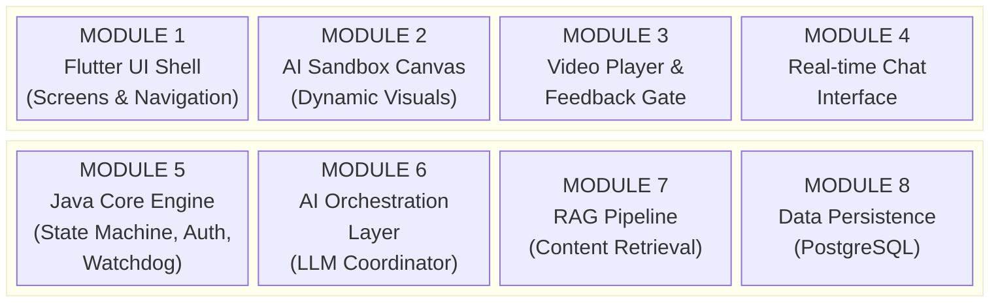
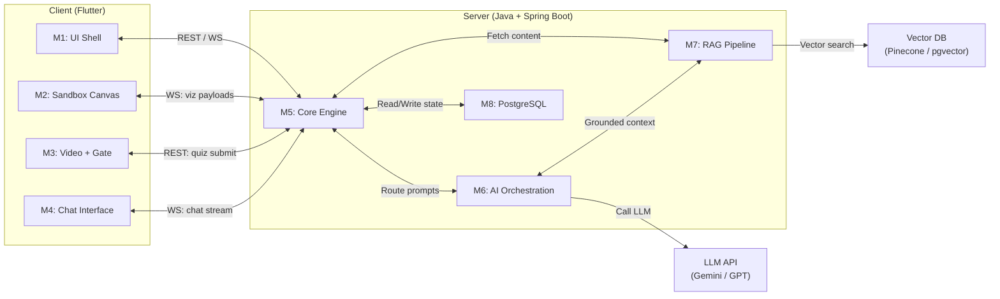

# Project Module Map: Agentic AI Learning Platform

This document provides a clean, de-confused breakdown of every module in the system, maps what each reference document already covers, and explains AI Orchestration in plain terms.

---

## 1. What Each Reference Document Covers

Before listing modules, here is what you already have documented and where:

| Reference Document | What It Covers | What It Does NOT Cover |
| :--- | :--- | :--- |
| [frontend_visualization_spec.md](file:///c:/CP/Oreo/frontend_visualization_spec.md) | All 6 screen layouts, CSS tokens, wireframes, TypeScript data schemas, state transition flow | No backend logic, no database design, no AI pipeline details |
| [AGENTIC MODULE.docx](file:///c:/CP/Oreo/AGENTIC%20MODULE.docx) | The AI brain: Dynamic Profiler (10-turn counselor), DAG Generator, Closed-Loop Evaluator, Smart Nudge Generator | No UI details, no database schema, no auth flow |
| [RAG MODULE.docx](file:///c:/CP/Oreo/RAG%20MODULE.docx) | Content ingestion pipeline, vector search (Pinecone), context-grounded chatbot, quiz generation from transcripts | No UI details, no user auth, no persona profiling |
| [UI MODULE.docx](file:///c:/CP/Oreo/UI%20MODULE.docx) | UX polish guidelines: OTP auto-advance, chat stagger animations, persona reveal transition, dashboard status indicators, feedback gate modal | No backend logic, no AI pipelines, no database |

> [!IMPORTANT]
> The three `.docx` files use a tech stack (Next.js, Python microservice, Pinecone) that was decided in a different context. We are treating them as **functional/behavioral references only** — the *what*, not the *how*. Our actual tech stack (Java + Spring Boot, Flutter, PostgreSQL, LangChain4j) is defined separately.

---

## 2. The Complete Module Map

The entire platform breaks down into **8 distinct modules** across 4 layers. Here is the full picture:

---

### Layer 1: Client / Frontend (Flutter)

---

#### MODULE 1 — Flutter UI Shell (Screens & Navigation)
* **What it is**: The skeleton of the app. All 6 screens, their layouts, transitions, and navigation routing.
* **Responsibility**:
  * Render the Entry Gate (OTP), Micro-Interview chat, Persona Reveal split-screen, Command Center dashboard, Learning Lab, and Resource Map.
  * Handle smooth animated transitions between phases (fade, slide, split).
  * Apply the dark-mode glassmorphic styling system (CSS tokens from the frontend spec).
  * Adapt rendering based on the backend's `render_mode` hint (e.g., show diagrams vs. show text).
* **Reference docs**: [frontend_visualization_spec.md](file:///c:/CP/Oreo/frontend_visualization_spec.md) (layouts), [UI MODULE.docx](file:///c:/CP/Oreo/UI%20MODULE.docx) (UX polish details)

---

#### MODULE 2 — AI Sandbox Canvas (Dynamic Visualization Engine)
* **What it is**: The interactive drawing surface inside the Learning Lab (Screen 05) where the AI can dynamically generate visuals to explain concepts.
* **Responsibility**:
  * Receive structured JSON payloads from the backend (SVG strings, node-edge diagrams, layout schemas).
  * Parse and render them using Flutter's `CustomPainter`, `flutter_svg`, or Remote Flutter Widgets (`rfw`).
  * Allow the student to **tap/interact** with rendered elements (e.g., tap a node to ask the AI about it).
  * Sync highlighted elements to the Mentor Chat via WebSocket events.
* **Reference docs**: [RAG MODULE.docx](file:///c:/CP/Oreo/RAG%20MODULE.docx) (sidekick chatbot context), [AGENTIC MODULE.docx](file:///c:/CP/Oreo/AGENTIC%20MODULE.docx) (closed-loop evaluator)
* **This module is NEW** — not fully covered in any existing doc.

---

#### MODULE 3 — Video Player & Feedback Gate
* **What it is**: The content consumption widget and the quiz-based checkpoint that blocks progression.
* **Responsibility**:
  * Embed and play video content fetched by the RAG pipeline.
  * When the student clicks "Complete," present the dynamically generated quiz (from MODULE 7).
  * On pass: trigger success animation, unlock next node on the dashboard.
  * On fail: show feedback, route back to dashboard where a remedial node has been injected by MODULE 6.
* **Reference docs**: [UI MODULE.docx](file:///c:/CP/Oreo/UI%20MODULE.docx) (feedback gate UX), [RAG MODULE.docx](file:///c:/CP/Oreo/RAG%20MODULE.docx) (quiz generator)

---

#### MODULE 4 — Real-time Chat Interface
* **What it is**: The AI Mentor chatbot panel that appears alongside the video player (Learning Lab) and during onboarding (Micro-Interview).
* **Responsibility**:
  * Display streamed AI responses with typing indicators and staggered animations.
  * Send user messages + current context (video timestamp, highlighted canvas node) to the backend via WebSocket.
  * Receive and render intervention payloads (Watchdog micro-quizzes) that slide in when the student is idle.
* **Reference docs**: [UI MODULE.docx](file:///c:/CP/Oreo/UI%20MODULE.docx) (chat UX polish), [AGENTIC MODULE.docx](file:///c:/CP/Oreo/AGENTIC%20MODULE.docx) (dynamic profiler reply flow)

---

### Layer 2: Backend Core (Java + Spring Boot)

---

#### MODULE 5 — Java Core Engine (State Machine, Auth, Watchdog)
* **What it is**: The central nervous system. Manages user sessions, enforces state transitions, handles authentication, and runs the background Watchdog.
* **Sub-components**:

| Sub-component | What It Does |
| :--- | :--- |
| **Auth Service** | Handles phone/email input, OTP generation, OTP verification, JWT token issuance. |
| **Session State Machine** | Enforces the rule: a user cannot access the Command Center until their persona is validated. Tracks which phase (Onboarding → Calibration → Execution) the user is in. |
| **Track Manager** | Stores the user's personalized DAG (learning track). Manages node status updates (locked → active → completed). Inserts remedial nodes when the AI Evaluator says "fail." |
| **Watchdog Worker** | A background `@Scheduled` thread that monitors user heartbeats. If no activity for 3 minutes (real-time) or 72 hours (long-term), it triggers MODULE 6 to generate nudges/micro-quizzes and pushes them to the client via WebSocket. |
| **WebSocket Server** | Maintains STOMP sessions. Routes messages between the Flutter client and MODULE 6/7. Pushes server-initiated events (interventions, track updates). |

* **Reference docs**: [AGENTIC MODULE.docx](file:///c:/CP/Oreo/AGENTIC%20MODULE.docx) (handoff logic, confidence_score checks, DAG mutation on failure), [UI MODULE.docx](file:///c:/CP/Oreo/UI%20MODULE.docx) (auth flow expectations)

---

#### MODULE 6 — AI Orchestration Layer (The LLM Coordinator)
* **What it is**: This is the **brain router**. It does NOT contain the LLM itself. It is the Java service layer that decides *when* to call the LLM, *what prompt* to send, and *how to interpret* the structured JSON response.

> [!NOTE]
> **"AI Orchestration" explained in plain terms:**
>
> Think of it like a restaurant kitchen. The LLM (e.g., Gemini, GPT) is the **chef** — it can cook anything you ask. But you still need a **head waiter** who takes the customer's order, translates it into a kitchen ticket, sends it to the chef, receives the plated dish, and delivers it to the right table.
>
> **AI Orchestration = the head waiter.** It:
> 1. **Decides when to call the LLM** — e.g., "The student just typed a message during onboarding, I need to call the Dynamic Profiler pipeline."
> 2. **Builds the prompt** — Attaches the student's cognitive profile, their current node, the video transcript, and conversation history into a structured prompt template.
> 3. **Enforces the output format** — Uses structured output schemas (JSON mode) so the LLM returns parseable data, not free-form text.
> 4. **Routes the response** — Takes the LLM's JSON response, extracts the `reply_to_user` (sends it to the chat), extracts the `internal_state` (sends it to the State Machine), extracts `new_node` (sends it to the Track Manager).
>
> Without orchestration, you would have raw LLM calls scattered everywhere with no consistency. The orchestration layer is what makes the system feel "agentic" — it coordinates multiple AI pipelines into a single coherent loop.

* **Pipelines managed by this module** (all from [AGENTIC MODULE.docx](file:///c:/CP/Oreo/AGENTIC%20MODULE.docx)):

| Pipeline | Trigger | What the LLM Does | What Java Does With the Response |
| :--- | :--- | :--- | :--- |
| **Dynamic Profiler** | Every chat turn during onboarding | Generates `reply_to_user` + silently computes `confidence_score` and `current_inferred_persona` | Displays reply in chat. Checks `confidence_score > 90%` → shows "Generate My Track" button. |
| **DAG Generator** | User clicks "Generate My Track" | Translates persona into a structured learning DAG (nodes with prerequisites) | Writes the DAG to PostgreSQL. Renders the Track Index on the Command Center. |
| **Closed-Loop Evaluator** | User submits a quiz answer | Grades the answer against the node's content. Returns pass/fail + optional remedial node | On pass: unlocks next node. On fail: injects remedial node into the DAG. |
| **Smart Nudge Generator** | Watchdog detects inactivity (72h) | Generates a contextual, emotionally-aware re-engagement message | Pushes the nudge to the client via WebSocket or notification. |
| **Sandbox Explainer** | Student asks a question while watching video | Generates an explanation + a visualization schema (SVG/JSON diagram) | Pushes the text to the chat panel and the visualization JSON to the Sandbox Canvas. |

* **Implementation**: Uses **LangChain4j** (Java library) to manage prompt templates, conversation memory, and structured output parsing.

---

#### MODULE 7 — RAG Pipeline (Content Retrieval & Grounding)
* **What it is**: The content supply chain. Fetches the right learning material (videos, articles, docs) for each track node and grounds the AI chatbot in that specific material.
* **Responsibility**:
  * **Ingestion** (one-time setup): Convert curated tutorials, video transcripts, and articles into vector embeddings and store them in a vector database.
  * **Retrieval**: When a student opens a track node, query the vector DB using the node's topic + the student's preferred modality (visual/text) as filters. Return the best-matching content URL and transcript.
  * **Grounding**: Attach the retrieved transcript to the LLM's system prompt so the chatbot answers questions using *only* the material the student is currently studying.
  * **Quiz Generation**: Use the retrieved transcript to generate contextual quiz questions for the Feedback Gate.
* **Reference docs**: [RAG MODULE.docx](file:///c:/CP/Oreo/RAG%20MODULE.docx) (all 4 sections)

---

#### MODULE 8 — Data Persistence (PostgreSQL)
* **What it is**: The database layer storing all stateful data.
* **Tables / Schemas**:

| Table | Key Data | Format |
| :--- | :--- | :--- |
| `users` | Phone/email, OTP status, JWT tokens, created_at | Relational |
| `learner_personas` | `cognitive_profile` (logic, visualization, applied, theoretical scores), `traits`, `render_mode` | `JSONB` column |
| `learning_tracks` | `track_id`, `goal`, `nodes` array (with id, title, type, status, prereqs) | `JSONB` column |
| `node_resources` | Resource URL, type (doc/video/repo), linked node_id | Relational |
| `activity_log` | User ID, event type (click, message, idle), timestamp | Relational (append-only) |
| `chat_history` | Session ID, role (user/ai), message text, metadata | Relational + `JSONB` |

---

## 3. Module Dependency Map

This shows which modules talk to which:

---

## 4. Summary: What is Built vs. What is Remaining

| Module | Status | Documented In |
| :--- | :--- | :--- |
| M1: Flutter UI Shell | ✅ Spec complete (layouts, tokens, flows) | `frontend_visualization_spec.md` + `UI MODULE.docx` |
| M2: AI Sandbox Canvas | 🟡 Architecture defined, implementation pending | Our new spec (remaining_components.md) |
| M3: Video Player & Feedback Gate | ✅ Behavior defined | `RAG MODULE.docx` + `UI MODULE.docx` |
| M4: Real-time Chat Interface | ✅ Behavior defined | `UI MODULE.docx` + `AGENTIC MODULE.docx` |
| M5: Java Core Engine | 🔴 Not yet implemented | Partially described across all 3 docx files |
| M6: AI Orchestration Layer | 🔴 Not yet implemented | `AGENTIC MODULE.docx` (pipelines defined) |
| M7: RAG Pipeline | 🔴 Not yet implemented | `RAG MODULE.docx` (behavior defined) |
| M8: Data Persistence | 🔴 Not yet implemented | Not documented yet |
