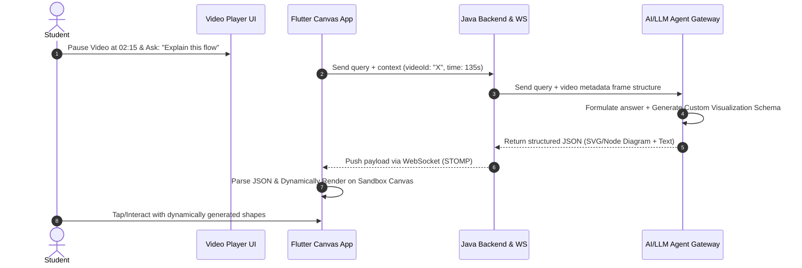
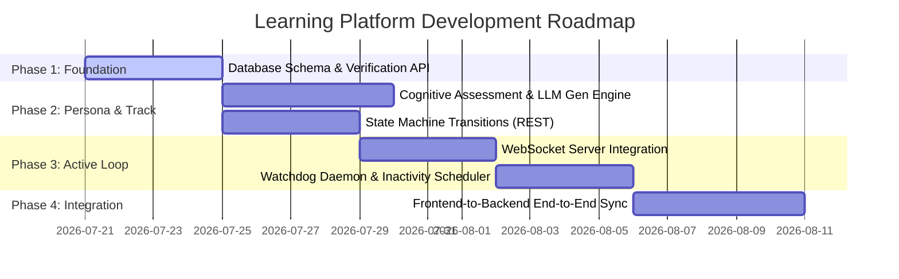

# Architectural Specification: Tech Stack & Implementation Roadmap

This document outlines what is currently covered in the specification, details the recommended technology stack for the remaining backend and system components, and provides a structured development roadmap.

---

## 1. What is Currently Covered

The [frontend_visualization_spec.md](file:///c:/CP/Oreo/frontend_visualization_spec.md) defines:
1. **Visual Styling Tokens**: Standard CSS colors, neon-glow properties, and glassmorphic variables.
2. **Phase-based Navigation & States**:
   * **Phase 1: Onboarding**: Screen 01 (Entry Gate - Phone & OTP verification) and Screen 02 (Micro-Interview chat context).
   * **Phase 2: Calibration**: Screen 03 (Split-screen negotiation with live updates and "Accept Quest" action).
   * **Phase 3: Tactical Execution**: Screen 04 (Command Center skill tree with Watchdog timer), Screen 05 (Dual-pane Learning Lab with sync triggers), and Screen 06 (Resource Map with pulsing neon nodes).
3. **Data Schemas**: TypeScript interfaces for `LearnerPersona`, `TrackNode`, `ResourceItem`, `LearningTrack`, and `PathNegotiationPayload`.

---

## 2. Tech Stack Recommendations & Cross-Platform Options

Based on your requirement for **dynamic flexibility to dual-boot Web, Android, Windows 11, and macOS**, here is the updated stack:

### A. Core Stack Table
| Layer | Recommended Technology | Rationale |
| :--- | :--- | :--- |
| **Backend Framework** | **Java + Spring Boot (3.x)** | Robust concurrency control. Built-in scheduling and STOMP over WebSocket streams. |
| **Real-time Protocol**| **Spring WebSocket (STOMP)** | Low-latency duplex JSON streaming. Allows Canvas $\leftrightarrow$ Mentor sync and Watchdog quiz pushes. |
| **Database** | **PostgreSQL (v15+)** | Relational stability combined with rich `JSONB` document storage for `LearnerPersona` and tracks. |
| **AI Orchestration** | **LangChain4j** | Standard Java integration for LLMs, allowing prompt templating and structured JSON outputs. |
| **Watchdog Scheduler**| **Project Reactor / WebFlux** | Reactive scheduling for lightweight, scale-out monitoring of user session activities. |
| **Frontend Framework** | **Flutter (Dart)** *(Recommended)* | Native compilation to Web, Android, Windows 11, and macOS from a single codebase. |

---

## 3. Cross-Platform Frontend Framework Comparison

To deliver the high-fidelity design specs (glowing neon, glassmorphism, fluid transitions) across Web, Mobile (Android), and Desktop (Windows 11 / macOS), we compare three primary cross-platform architectures:

### Option 1: Flutter (Dart) — (Recommended)
* **How it works**: Uses the Skia/Impeller graphics engine to draw every pixel directly to a canvas, bypassing platform-native components.
* **Pros**:
  * **Absolute UI Consistency**: Custom shaders, glowing neon shadows, and glassmorphic designs render identically on Web, Android, Windows 11, and macOS.
  * **Rich Custom Painting**: The complex interactive node diagrams in Screen 05 (Learning Lab) can be built using custom painters and SVGs easily.
  * **Integrated Tooling**: The local environment has a dedicated `dart-mcp-server` allowing us to launch, debug, and hot-reload apps programmatically.
* **Cons**: Larger initial JS/WASM bundle size for Web compared to raw HTML/React.

### Option 2: React (TypeScript) + Capacitor (Mobile) + Tauri/Electron (Desktop)
* **How it works**: Build a React web app. Wrap it in Capacitor for Android and Tauri/Electron for Windows/macOS.
* **Pros**:
  * Excellent for pure Web performance and SEO.
  * Leverages existing web design libraries (Framer Motion, Tailwind, CSS variables).
* **Cons**:
  * Higher maintenance overhead (managing Capacitor plugins, Tauri configs, and web wrappers separately).
  * Inconsistencies in Webview engines across Android vs. desktop wrappers can break complex CSS glow/blur filters.

### Option 3: Compose Multiplatform (Kotlin/Java)
* **How it works**: Jetpack Compose adapted for desktop and web (using Canvas/WASM).
* **Pros**:
  * Keep the entire stack in the JVM/Java ecosystem.
  * Direct interop with backend models if shared in Kotlin libraries.
* **Cons**:
  * Compose HTML/Web is still maturing compared to Flutter Web and React.
  * Smaller community library ecosystem for complex interactive diagram editors.


---

## 3. AI Sandbox Canvas: Dynamic Visualization & Interactive Video Strategy (Flutter)

Yes, you can absolutely build the **AI Sandbox Canvas** in Flutter. Because Flutter renders custom graphics at a native pixel level (using CanvasKit or Impeller), it is actually *better* suited for high-fidelity dynamic visuals than standard webviews or HTML divs.

Here is the architectural strategy for how the student-to-AI interaction works when the student asks a question during video playback:



### How the LLM Controls the Canvas dynamically:

Since compiled languages like Dart/Flutter do not support running raw runtime code strings easily, we use **data-driven rendering** where the LLM returns structured JSON schemas that the Flutter client translates into visuals:

#### 1. Dynamic Vector (SVG) Rendering *(Highly Flexible)*
* **Mechanism**: The LLM generates a custom vector diagram in XML format (`<svg>...</svg>`).
* **Flutter Implementation**: The Flutter app receives the SVG string and renders it instantly using the `flutter_svg` package.
* **Why it's great**: Excellent for custom architectures, arrows, tables, and sequence diagrams with precise color customization (e.g., neon glows mapping to our visual spec).

#### 2. JSON-based Custom Painting (Nodes & Connections)
* **Mechanism**: The LLM returns a lightweight diagram schema:
  ```json
  {
    "type": "flow_diagram",
    "nodes": [
      {"id": "n1", "label": "Client UI", "x": 100, "y": 150, "style": "neon-cyan"},
      {"id": "n2", "label": "WebSocket Server", "x": 300, "y": 150, "style": "neon-purple"}
    ],
    "edges": [
      {"from": "n1", "to": "n2", "label": "Connect", "animated": true}
    ]
  }
  ```
* **Flutter Implementation**: A custom widget parses the JSON and draws the nodes and lines on a Flutter `Canvas` using a `CustomPainter`.
* **Why it's great**: Allows custom touch-interaction (students can tap node "Client UI" to highlight or trigger a micro-quiz).

#### 3. Server-Driven UI (Dynamic Remote Widgets)
* **Mechanism**: The LLM suggests layout elements (Rows, Columns, Text, Buttons, Images).
* **Flutter Implementation**: We use the official `rfw` (Remote Flutter Widgets) package or a custom JSON-to-Widget parser. 
* **Why it's great**: The AI can literally customize the UI layout of the explanation panel on the fly.

#### 4. Mermaid.js Diagram Integration
* **Mechanism**: The LLM outputs standard Mermaid markup (`graph TD; A-->B;`).
* **Flutter Implementation**: Renders in a lightweight WebView frame or via a markdown parsing widget.

---

## 4. The Implementation Plan (Milestone Roadmap)



### Milestone 1: DB Schema & Auth Bridge (Duration: 4 Days)
* Setup Spring Boot project structure with Java 17/21.
* Create PostgreSQL database schemas supporting phone/OTP verification tables and JSONB columns for profile/track schemas.
* Develop REST endpoint for Screen 01 (`/auth/send-otp` and `/auth/verify-otp`).

### Milestone 2: AI Cognitive Assessment & Track Generation (Duration: 5 Days)
* Implement the Oboarding Micro-Interview API.
* Write LLM wrapper (via LangChain4j) to analyze user interview answers and return the structured `LearnerPersona` JSON.
* Design the Curriculum Generator service to build customized `LearningTrack` nodes depending on the cognitive profile.
* Create the Track Negotiation API (`/track/negotiate`) to allow swapping/adding modules during Phase 2.

### Milestone 3: WebSocket Sync & Interaction Bridge (Duration: 4 Days)
* Establish STOMP WebSocket configurations in the Java backend.
* Create communication channels:
  * `/topic/session/{id}/canvas-highlights` (Frontend highlights $\rightarrow$ AI Mentor context).
  * `/topic/session/{id}/mentor-responses` (AI Mentor $\rightarrow$ Frontend chat).
  * `/topic/session/{id}/interventions` (Backend pushes Watchdog quizzes).

### Milestone 4: Watchdog Loop & Intervention Daemon (Duration: 4 Days)
* Develop the background Watchdog monitoring worker in Java.
* Track user interaction events received via WebSocket.
* Write the scheduling logic to trigger when no events are received within 3 minutes, pushing the micro-quiz payload.
* Handle completion of the micro-quiz to shortcut/resume the path.

### Milestone 5: End-to-End Visual Integration (Duration: 5 Days)
* Connect the completed cross-platform UI (Flutter/React) to the Spring Boot REST/WS endpoints.
* Verify smooth animations during transition from Assessment $\rightarrow$ Reveal $\rightarrow$ Command Center.
* Load components dynamically using the backend's `render_mode` hint (visual vs. text-heavy layouts).
