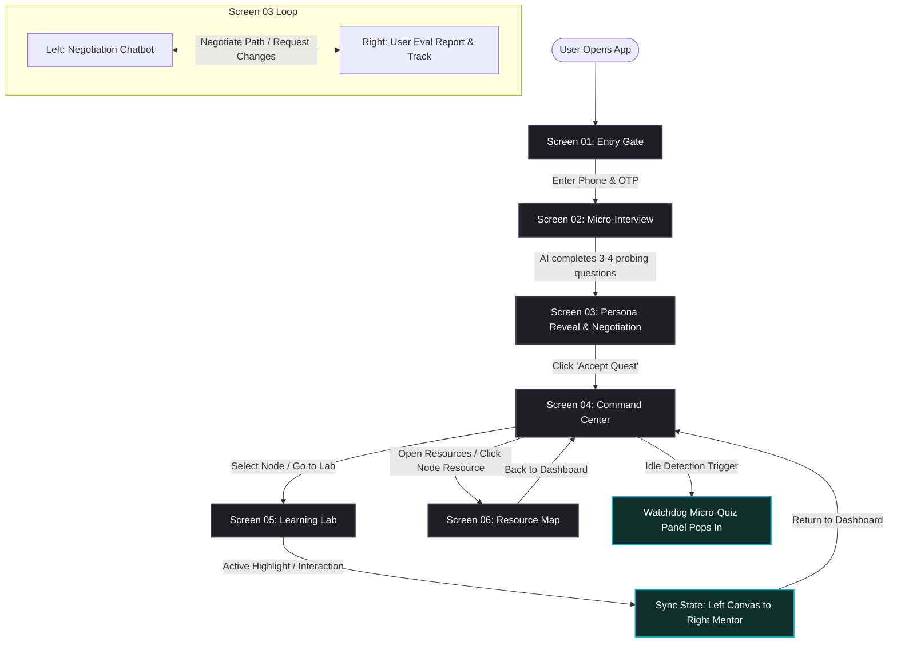
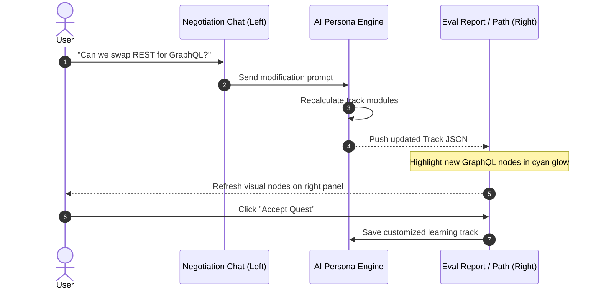

# Interactive Learner Journey: Frontend Layout & Flow Specification

This specification documents the interface layouts, user flow transitions, CSS styling parameters, and system integration patterns for the 6 screens across the 3 phases of the adaptive learning platform. It serves as a blueprint for frontend developers building UI mockups and implementing core logic.

---

## 1. Global User Flow & State Transitions

This flowchart illustrates the navigation path, state transitions, and logic hooks connecting the 6 screens.



---

## 2. Visual Styling System (Design Tokens)

To achieve a **minimalist, premium dark-mode aesthetic with rich glowing components**, developers should implement the following CSS design tokens:

```css
:root {
  /* Color Palette */
  --bg-darker: #0d0d12;       /* App background */
  --bg-card: rgba(30, 30, 42, 0.4); /* Glassmorphic panel base */
  --fg-primary: #f3f4f6;      /* High-contrast text */
  --fg-secondary: #9ca3af;    /* Muted captions */
  
  /* Glowing / Accent Colors */
  --accent-purple: #7b2cbf;   /* Core theme color */
  --accent-cyan: #00b4d8;     /* System hooks / status */
  --accent-green: #38b000;    /* Success / Quest completed */
  --accent-warning: #ffb703;  /* Watchdog alerts */
  
  /* Glowing Shadows */
  --glow-purple: 0 0 15px rgba(123, 44, 191, 0.6);
  --glow-cyan: 0 0 15px rgba(0, 180, 216, 0.6);
  --glow-green: 0 0 15px rgba(56, 176, 0, 0.6);
  
  /* Blur & Borders */
  --glass-blur: blur(12px);
  --border-glow: 1px solid rgba(255, 255, 255, 0.08);
  --border-active: 1px solid rgba(123, 44, 191, 0.5);
  
  /* Fonts */
  --font-sans: 'Outfit', -apple-system, BlinkMacSystemFont, sans-serif;
  --font-mono: 'JetBrains Mono', monospace;
}
```

---

## 3. Screen Specifications & Wireframe Layouts

### Phase 1: The Onboarding (Data Extraction)

#### Screen 01: The Entry Gate (Authentication)
* **Goal**: ZERO to chat in under 10 seconds. Frictionless, immediate feedback loop.
* **Layout**: Minimalist centered column. Email/Password login with a Google Sign-In shortcut.

```
+-------------------------------------------------------------+
|                                                             |
|                           [ LOGO ]                          |
|                     "Welcome to the Sync"                   |
|                                                             |
|                   +-------------------------+               |
|                   |  Email: alex@mail.com   |               |
|                   +-------------------------+               |
|                   +-------------------------+               |
|                   |  Password: ••••••••     |               |
|                   +-------------------------+               |
|                                                             |
|                        [ Sign In ]                          |
|                    Don't have an account?                    |
|                        [ Register ]                         |
|                                                             |
|                     ──── or ────                            |
|                                                             |
|                  [ G  Continue with Google ]                 |
|                                                             |
+-------------------------------------------------------------+
```
* **UX/Interaction Note**:
  - The "Sign In" button validates email format and password strength (min 8 chars) before firing the request.
  - "Continue with Google" launches the native Google consent screen via the `google_sign_in` package; on success, the returned ID token is sent to `POST /auth/google`.
  - Upon receiving the JWT from either method, the screen fades directly into the Micro-Interview chat. No intermediate loading screens.

---

#### Screen 02: The Micro-Interview (The Assessment)
* **Goal**: Gather parameters to build a cognitive profile without standard form fields.
* **Layout**: Centered, distraction-free chat container. Fixed prompt height at bottom.

```
+-------------------------------------------------------------+
| [Header: Persona Calibration Active]                        |
+-------------------------------------------------------------+
|                                                             |
|   [AI Mentor] "First, tell me what you're trying to build   |
|   or learn over the next 14 days."                          |
|                                                             |
|   [User] "I want to build a real-time portfolio dashboard   |
|   using React and WebSockets."                              |
|                                                             |
|   [AI Mentor] "Got it. When picking up complex system APIs, |
|   do you prefer to see raw code structure or a structural   |
|   diagram first?"                                           |
|                                                             |
|   [User] "Definitely visual diagrams."                      |
|                                                             |
|   [AI Mentor] "Understood. I have enough to map your track. |
|   Let's check out your Eval Report."                        |
|                                                             |
|                  +-----------------------+                  |
|                  |  View Eval & Adjust  |                  |
|                  +-----------------------+                  |
+-------------------------------------------------------------+
```
* **UX/Interaction Note**:
  - Once the 3rd or 4th probing question is answered, the final AI bubble displays alongside a high-contrast button to slide into the validation phase. There is no artificial gate or confidence loading bar.

---

### Phase 2: The Calibration (The Validation)

#### Screen 03: The Persona Reveal & Negotiation (The "Aha!" Moment)
* **Goal**: Trust & personalization. Show the AI's assessment and negotiate modifications to the generated track.
* **Layout**: Cinematic split-screen. Left panel (30%) is the active chatbot for track tuning. Right panel (70%) displays the interactive Persona Canvas and Proposed Learning Path.

```
+----------------------------+--------------------------------------------------------+
| Left Panel (30% Width)     | Right Panel: Persona Canvas & Eval Report (70% Width)  |
|                            |                                                        |
| [Chat: Path Negotiation]   |  LEARNER PERSONA: THE DEADLINE-DRIVEN SPRINT PROCESS   |
|                            |                                                        |
| AI: "Here is your cognitive|        Cognitive Strength Profile                      |
| profile and proposed React |               [Logic]                                  |
| WebSocket track. Any items |                 /\                                     |
| you want to swap out?"     |                /  \                                    |
|                            |     [Text] *--/----\-* [Visualization]                 |
| User: "Can we skip basic   |               \    /                                   |
| JS? Swap it for GraphQL."  |                \  /                                    |
|                            |                 \/                                     |
| AI: "Done. Swapping out    |              [Applied]                                 |
| Module 1 with GraphQL APIs.|  Proposed Track:                                       |
| Take a look at the track." |  - [Swapped] Node 01: GraphQL Subscriptions (Neon Red)  |
|                            |  - [Active]  Node 02: WebSocket Clients & Hooks        |
|                            |  - [Active]  Node 03: Performance Optimization         |
|                            |                                                        |
| +------------------------+ |                                                        |
| | Send adjustment...     | |                     [ ACCEPT QUEST ]                   |
| +------------------------+ |           (Locks in track and goes to Dashboard)       |
+----------------------------+--------------------------------------------------------+
```
* **UX/Interaction Note**:
  - **Live Path Updates**: When the user requests a modification on the left, the Right panel's "Proposed Track" list updates dynamically. Swapped nodes transition visually with a subtle alert color highlight.
  - **Accept Quest**: Once both user and AI agree on the final list, clicking "Accept Quest" registers the customized path to the user's active session.

---

### Phase 3: The Tactical Execution (The Learning Loop)

#### Screen 04: The Command Center (The Adaptive Dashboard)
* **Goal**: Progress tracking, motivation, and navigation hub.
* **Layout**: Top section features positive engagement metrics (not a countdown timer). Left column is the linear/vertical skill tree. Optional right overlay for Watchdog interventions.

```
+-------------------------------------------------------------+
| 🔥 Streak: 3 days   ⏱ Time Invested: 2h 15m   📊 67% Done  |
|              [ ⏸ Pause Session ]                             |
+-------------------------------------------------------------+
|                                                             |
|  Track Index: GraphQL & React Dashboards                    |
|                                                             |
|  [Complete] ✅ Node 01: GraphQL Subscriptions Basics        |
|                  |                                          |
|  [Active]   🔵 Node 02: React Hooks and State Sync   <---   |
|                  |                                          |
|  [Locked]   🔒 Node 03: Performance Optimization           |
|                                                             |
|                                   +-----------------------+ |
|                                   | 💬 Nudge              | |
|                                   | "Still thinking?      | |
|                                   |  No rush — take your  | |
|                                   |  time."                | |
|                                   +-----------------------+ |
|                                     ^ (Slides in at 5 min)  |
+-------------------------------------------------------------+
```
* **UX/Interaction Note**:
  - **No visible countdown timer** (UX7 Fix). The Watchdog operates silently in the background.
  - **Positive metrics bar**: Shows streak (consecutive study days), time invested (total session time), and completion percentage — all motivational, not anxiety-inducing.
  - **Pause Session**: Student can tap "⏸ Pause Session" to explicitly disable Watchdog monitoring. Useful when stepping away.
  - **Idle Detection** (UX2 Fix): System tracks activity. If idle > 5 minutes, a **gentle nudge** slides in first (not a quiz). Only after 10 minutes does a micro-quiz appear. See M5 escalation pattern.

---

#### Screen 05: The Learning Lab (The Adaptive Sync Zone)
* **Goal**: Deep visual/conceptual alignment. Real-time updates between documentation and the AI Chatbot.
* **Layout**: Dual-pane. Left (Adaptive Canvas) vs. Right (Mentor Chat).

```
+-----------------------------------------------------+-----------------------+
| Left: Adaptive Canvas (50% Width)                   | Right: Mentor Chat    |
|                                                     | (50% Width)           |
| +-------------------------------------------------+ |                       |
| | Interactive Diagram (Mermaid / SVG)             | | [AI Mentor]           |
| |                                                 | | "I see you highlighted|
| |  [React Component]                              | | the React hook. Here's|
| |          |                                      | | how it syncs with the|
| |          v  (highlighted)                       | | WebSocket client in  |
| |   ======[useEffect Hook]=======                 | | Node 02."             |
| |                                                 | |                       |
| |                                                 | | [User] "Why cleanup?" |
| |                                                 | |                       |
| |                                                 | | [AI Mentor]           |
| |                                                 | | "To avoid dangling    |
| |                                                 | | connections..."       |
| +-------------------------------------------------+ |                       |
|                                                     |                       |
+-----------------------------------------------------+-----------------------+
```
* **UX/Interaction Note**:
  - Left pane displays content dynamically based on Learner Persona traits.
  - Clicking/Highlighting any element in the Left Canvas generates a window-level dispatch event containing metadata about that step/node. The AI Chatbot consumes this event and updates its context immediately.

---

#### Screen 06: The Resource Map
* **Goal**: Deliver a highly structured index of external reference docs, videos, tutorials, and repositories connected to each track node.
* **Layout**: Column grid mapping track nodes directly to structured resources.
* **Visuals**: Semi-transparent lines link nodes to card assets. Active nodes and their corresponding resource cards are highlighted with a glowing neon border.

```
+-------------------------------------------------------------+
| [Header: Customized Resource Map]                           |
+-------------------------------------------------------------+
|                                                             |
|   Node 01: GraphQL Subscriptions                            |
|   +------------------------+    +------------------------+  |
|   | [Doc] Apollo API Ref   |    | [Video] Subscriptions  |  |
|   | Neon Cyan Glow         |    | Neon Cyan Glow         |  |
|   +------------------------+    +------------------------+  |
|                                                             |
|   Node 02: WebSocket Clients & Hooks                        |
|   +------------------------+    +------------------------+  |
|   | [Repo] WS Boilerplate  |    | [Doc] React Hooks API  |  |
|   | Muted border           |    | Muted border           |  |
|   +------------------------+    +------------------------+  |
|                                                             |
|   Node 03: Performance Optimization                         |
|   +------------------------+    +------------------------+  |
|   | [Article] Bundle Size  |    | [Tools] Profiler Guide |  |
|   | Muted border           |    | Muted border           |  |
|   +------------------------+    +------------------------+  |
|                                                             |
|                   [ RETURN TO DASHBOARD ]                   |
+-------------------------------------------------------------+
```
* **UX/Interaction Note**:
  - Clicking on a resource card opens it in a split-frame view or new tab depending on screen size.
  - Cards corresponding to the currently active learning node feature animated pulsing cyan shadows to direct user attention.

---

## 4. State Integration & Sync Protocol

To implement this flow, the frontend needs to manage the following state objects:

### A. Learner Persona & Path Schema
```typescript
interface LearnerPersona {
  cognitiveProfile: {
    logic: number;          // 0 to 100
    visualization: number;  // 0 to 100
    applied: number;        // 0 to 100
    theoretical: number;    // 0 to 100
  };
  traits: string[];         // e.g., ["Deadline-Driven", "Visual-Heavy"]
}

interface TrackNode {
  id: string;
  title: string;
  description: string;
  status: 'locked' | 'active' | 'completed';
  resources: ResourceItem[];
}

interface ResourceItem {
  id: string;
  type: 'doc' | 'video' | 'repo' | 'article';
  title: string;
  url: string;
  isRecommended: boolean;
}

interface LearningTrack {
  trackId: string;
  goal: string;
  nodes: TrackNode[];
}
```

### B. Path Negotiation Protocol (Screen 03)
During negotiation on Screen 03, the client communicates modifications to the track structure:

```typescript
interface PathNegotiationPayload {
  action: 'add_node' | 'remove_node' | 'swap_node';
  targetNodeId?: string;
  replacementNodeId?: string;
  customTextPrompt?: string; // e.g. "I want GraphQL instead of basic REST"
}

// Emits payload to AI backend to generate updated track JSON
const requestTrackModification = (payload: PathNegotiationPayload) => {
  console.log("Negotiation request dispatched:", payload);
};
```

---

## 5. Screen Transition Sequence Diagram

The interaction sequence showing how the User, Canvas, and Mentor negotiate the track on Screen 03 before moving to execution.


